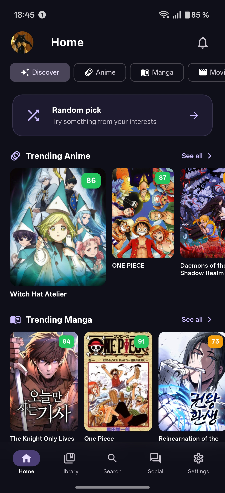
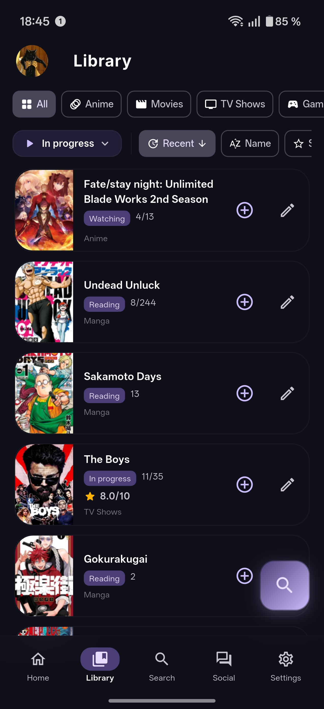
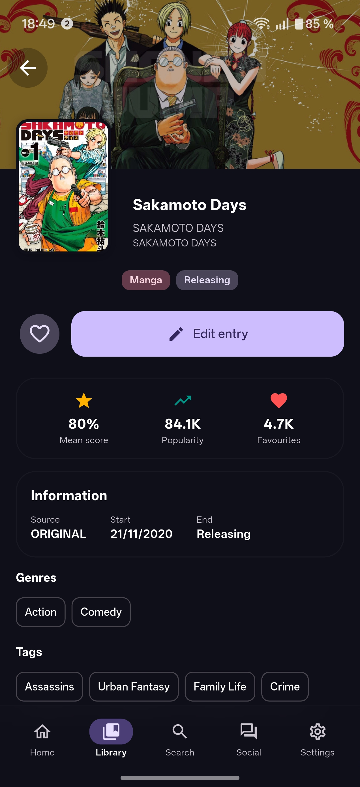
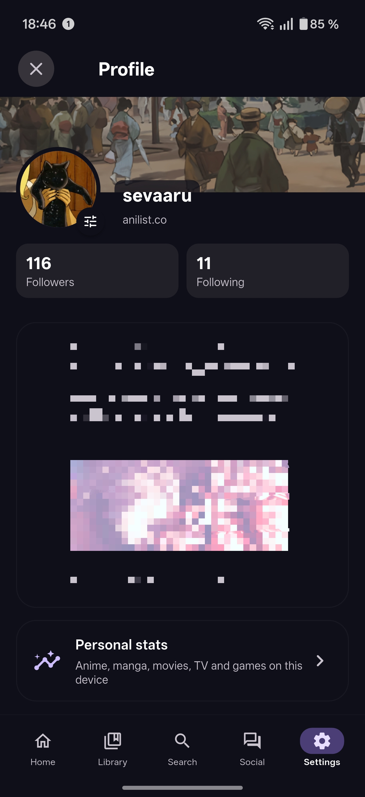
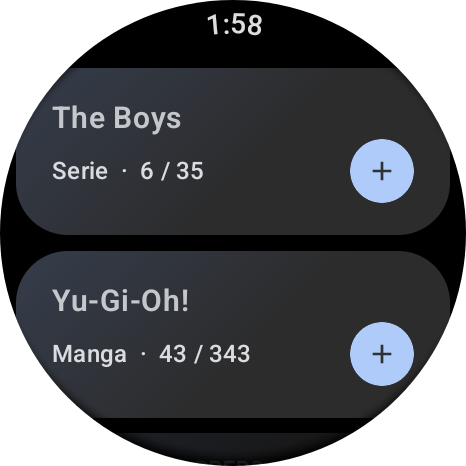
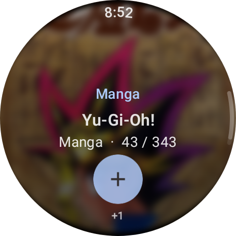

# CRONICLE

**The all-in-one tracker for everything you watch, read and play.**
Anime · Manga · Movies · TV · Games · Books — with offline-first storage and a Wear OS companion app.

**Current version:** `v1.1.2` (build 44) — Stable
**Platforms:** Android phone & tablet · Wear OS companion (paired)
**Min. Android:** 8.0 (API 26) · **Wear OS:** 3.0+ (API 30)

---

##  Screenshots

###  Android app

| Home | Library |
|---|---|
|  |  |

| Detail | Profile |
|---|---|
|  |  |

###  Wear OS companion

| Library | Detail |
|---|---|
|  |  |

---

##  Features

###  Track everything in one library
- Unified offline-first library backed by Drift (SQLite) — works fully without an internet connection.
- Six media kinds: **anime, manga, movies, TV, games, books**.
- Per-item progress: episode/chapter/page counters, scores, status, dates, custom notes.
- Custom categories, advanced sorting and filtering, batch editing.

###  Service integrations
- **AniList** — full OAuth login (PIN or HTTPS bridge with `cronicle://` deep link), library sync, activity feed, notifications inbox, forum threads, characters & staff, custom advanced scoring.
- **Trakt.tv** — OAuth login, watchlist/history sync for movies & shows, ratings, episode progress, user stats.
- **IGDB (via Twitch)** — game catalogue, releases, popularity sections and community reviews.
- **Google Books API** — search, trending, browse by subject, work + edition details with reading-progress tracking.

###  Discover & social
- **Discover feed** with trending across every category you enable, plus a "Surprise me" button.
- Filter rail: Anime/Manga, Movies/TV, Games, Books — reorderable from settings.
- **Social tab** with AniList global / following activity, replies and inline likes.
- Forum threads with nested comments, reply input and like support.

###  Profile & favourites
- Unified profile combining AniList header, Trakt session and local data.
- Favourites grouped by category: anime, manga, movies, TV, games, books, **AniList characters & staff**.
- Detailed character & staff pages with toggleable favourites, voice actors and appearances.
- Personal stats page with genre breakdowns, Trakt user stats and favourite carousels.

###  Wear OS companion
- Native Wear OS app paired by signature with the phone via the Wearable Data Layer.
- Browse your synced library directly from the watch (Compose for Wear OS).
- Glanceable **Tile** showing recent library items.
- Cross-device messaging keeps the watch in sync automatically.

###  Notifications
- Local notifications for newly-aired episodes/chapters.
- Optional AniList inbox polling (without resetting the unread counter).
- Fully configurable per category in Settings, scheduled via Workmanager.

###  UI & customisation
- Material 3 design with glassmorphism accents.
- Light & dark themes, dark by default.
- English & Spanish translations.
- Customisable bottom-nav, feed filter chips and library type bar.

###  Backup & sync
- Local JSON backup & restore.
- Optional Google Drive backup.
- All sync flows (AniList / Trakt / IGDB) are opt-in and run in the background.

###  Unified search
- One search bar covering AniList, Trakt, IGDB and Google Books with per-source filters.

---

##  Installation

1. Download the latest **`Cronicle-v1.1.2.apk`** from the [releases page](https://github.com/Sevaaru/Cronicle/releases/latest).
2. Allow installation from unknown sources if prompted.
3. (Optional) Install the **`Cronicle-wear-v1.1.2.apk`** on a paired Wear OS watch — both APKs must be signed with the same key, so use the bundle from the same release.

---

##  Disclaimer

The developer(s) of this application are not affiliated with any of the content providers integrated (AniList, Trakt, IGDB, Twitch, Google Books). Cronicle hosts **zero content** of its own; it only displays metadata returned by the official APIs after the user authenticates with their own accounts.

---

##  License

<pre>
Copyright © 2026 Sevaaru
Copyright © 2024 Cronicle Open Source Project
</pre>

